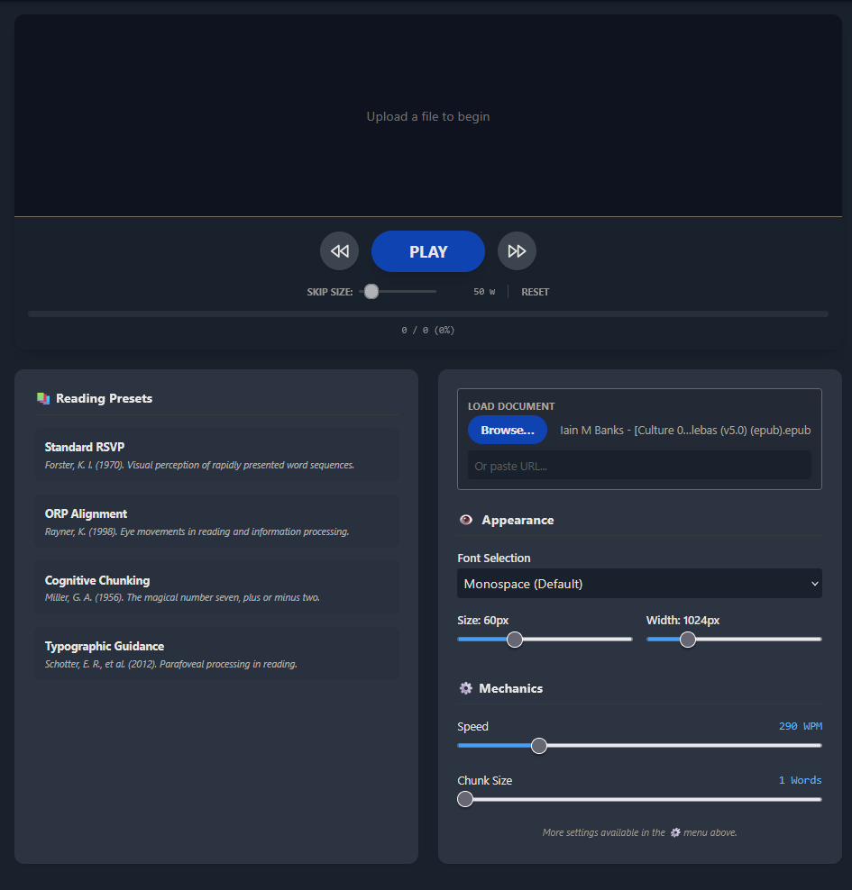
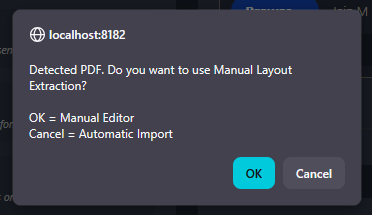
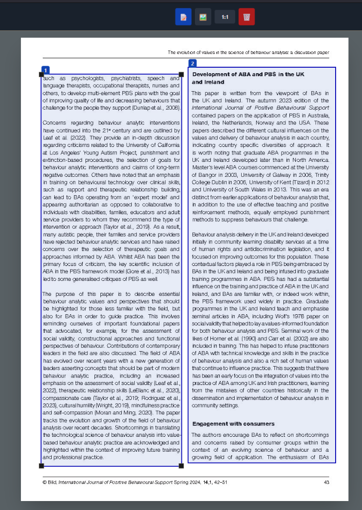
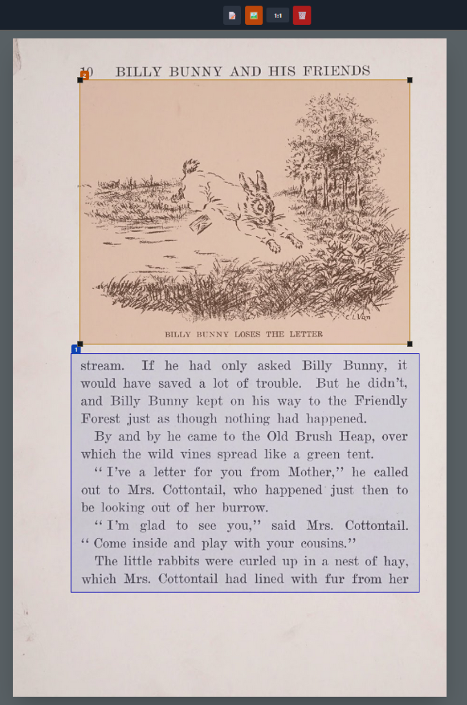

# WebReader - Scientific Speed Reader

A modern web application for speed reading PDFs, EPUBs, and Images using RSVP (Rapid Serial Visual Presentation) technology.



## Features

- **RSVP Speed Reading**: Read faster by eliminating eye movement.
- **Format Support**: PDF, EPUB, TXT, DOCX, and **Images** (.png, .jpg, .webp).
- **OCR Integration**: Automatically extracts text from scanned PDFs and images using Tesseract.
- **Text-to-Speech (TTS)**: Generate and download an MP3 audio version of your document.
- **Manual Layout Editor**: Select specific text boxes to read on PDF files, skipping headers/footers.
- **Modern UI**: Clean, glassmorphism-based design with Dark Mode support.
- **Image Gallery**: View and download images extracted from your documents.

## Installation

### Prerequisites

- Python 3.9+, Node.js, Redis, and Tesseract OCR

### 1. Clone the Repository

```bash
git clone https://github.com/Utility-SOC/WebReader.git
cd WebReader
```

## Running the Application

We've provided automated startup scripts to install dependencies and launch all necessary services (Backend, Frontend, and Celery Worker).

**For Windows:**
```powershell
# Open PowerShell and run:
.\run_windows.ps1

# Or simply double-click run_windows.bat
```

**For Linux / macOS:**
```bash
# Make the script executable and run:
chmod +x run_linux.sh
./run_linux.sh
```

*Note: Ensure Redis is running in the background before launching the application.*

## Basic Tutorial

WebReader is designed to be intuitive and fast. Here is how to use the core features:

### 1. Uploading a Document
- Click the **upload area** on the main screen to select a supported document (PDF, EPUB, TXT, DOCX, or Image).

**PDF Manual Extraction**: 
When you upload a PDF, you will be prompted to choose between Automatic Import or the Manual Editor:



If you select **OK**, you will enter the Manual Layout Editor. This powerful tool allows you to visually select exactly what text to read, ensuring you skip headers, footers, page numbers, or irrelevant sidebars.


**How to use the Manual Editor**:
1. **Draw Boxes**: Simply click and drag your mouse over the text blocks you want to read. A blue box will appear around your selection.
2. **Fit & Resize**: You can adjust the edges of your drawn boxes by clicking and dragging the black squares in the corners. If the page is too large or too small, toggle the **FIT / 1:1** button in the top toolbar to adjust the zoom level.

3. **Auto-Copy Layouts**: When you navigate to the next page using the top navigation arrows, you will notice that you do not have to redraw your rectangles! WebReader automatically copies your layout boxes from the previous page, allowing you to quickly verify or tweak the boxes rather than starting from scratch.


4. **Extract Images**: Want to save a picture from the PDF? Click the **Image button** (the picture icon) in the upper central toolbar. This allows you to draw an orange box to pull out pictures in the exact same way you pull out text!

5. **Mixed Content**: You can freely mix text and image extractions on a single page to capture everything important without reading the figures as text.

6. **Set Starting Page**: If the actual content of your book starts on a later page (e.g., page 15 after the table of contents and prefaces), navigate to that page using the arrows in the top left, and click **"Start Here"**. This marks the current page as the starting point for your reading session.

7. **Finish**: Once you have highlighted the layout blocks on the starting page, click **DONE** in the top right. WebReader will begin processing!

**EPUB Chapter Selection**: 
When uploading an EPUB, the application automatically extracts the table of contents. Once processing is complete, you can click the **Book icon** to open the Chapter Selector and immediately jump to the start of any chapter.

### 2. Reading with RSVP
- **Play/Pause**: Once processing is complete, press the large **Play** button (or click anywhere in the reading area) to start Rapid Serial Visual Presentation.
- **Navigation**: Use the **Left/Right arrows** to skip backward or forward by 50 words.
- **Progress Bar**: Drag the scrubber at the bottom to jump to any point in the text.

### 3. Customizing the Experience
- Click the **Gear icon** in the top right to open **Settings**.
- **Speed**: Adjust your target Words Per Minute (WPM) and the number of words shown at once (Chunk Size).
- **Appearance**: Change fonts, text size, and the width of the reading area.
- **Dynamic Punctuation**: WebReader slows down slightly at commas, periods, and paragraphs. You can tweak these delays in the settings.

### 4. Advanced Features
- **Chapters (Book Icon)**: When reading an EPUB, click the book icon to navigate directly to specific chapters.
- **Gallery (Image Icon)**: If your document contains illustrations or figures, click the image icon to view them in a dedicated gallery.
- **Downloads**: 
  - Click the **Document icon** to download a clean text transcript (`.txt`) of your file.
  - Click the **Volume icon** to generate and download an MP3 audiobook using Text-to-Speech (TTS).

## Troubleshooting

- **Upload Stuck?**: Ensure the worker process started correctly from the launch script. The API delegates heavy processing to Celery.
- **OCR Failed?**: Ensure `tesseract` is installed and in your system PATH.

## License

MIT
