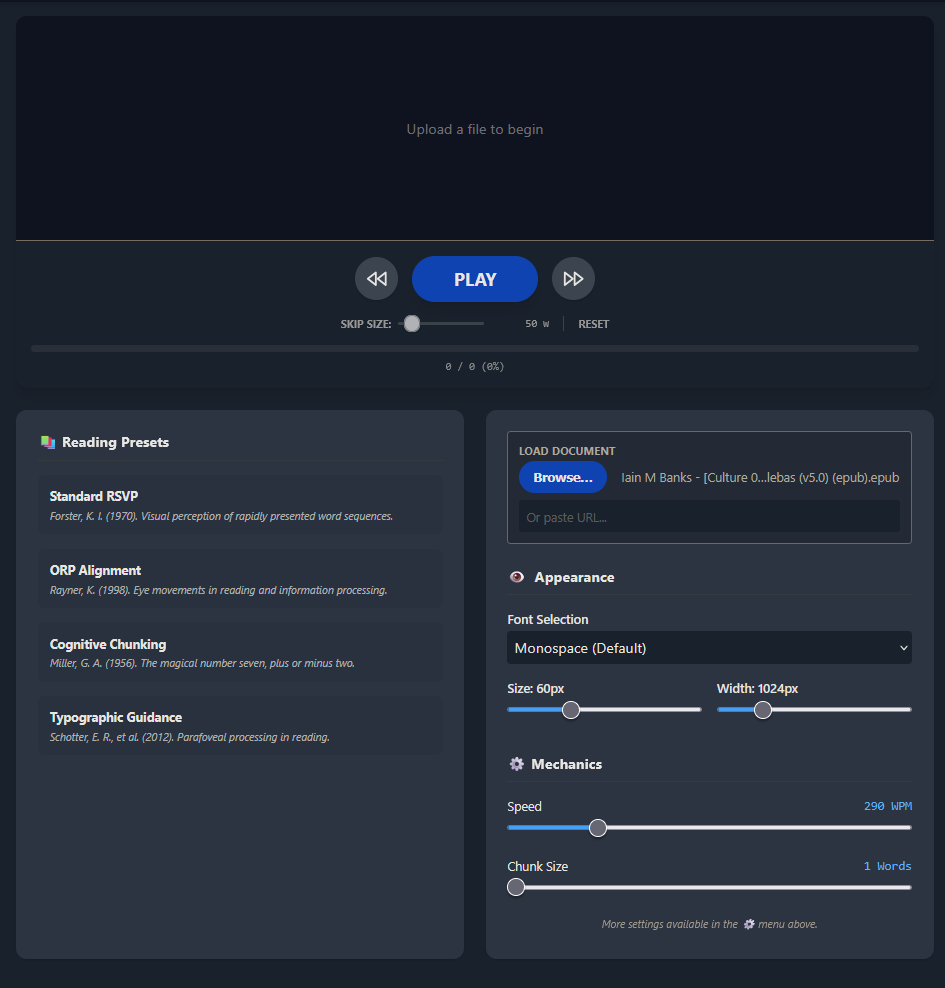
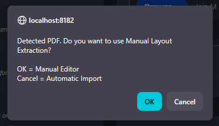
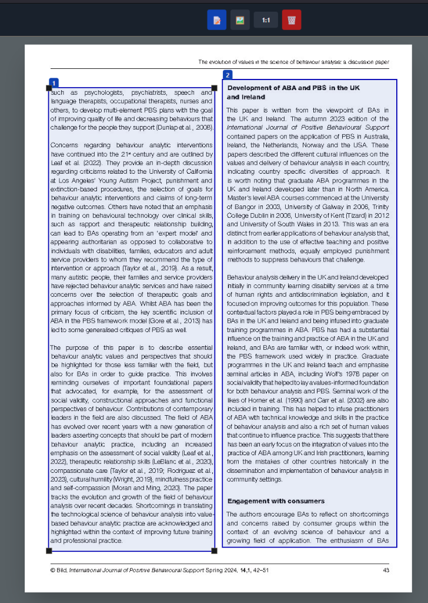
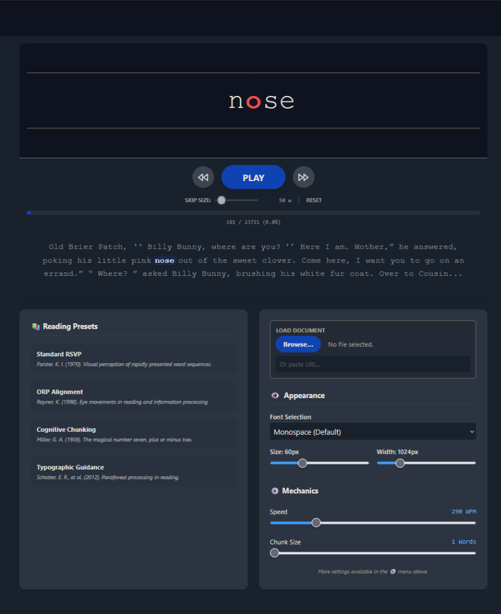
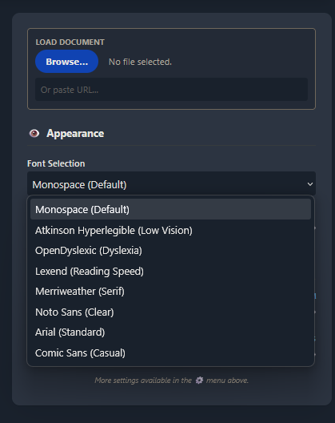
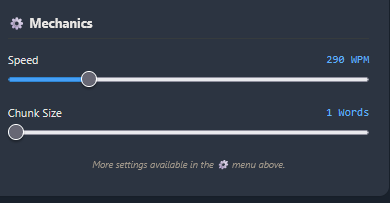
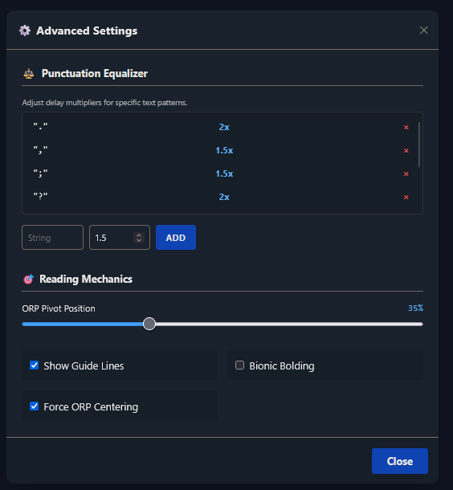
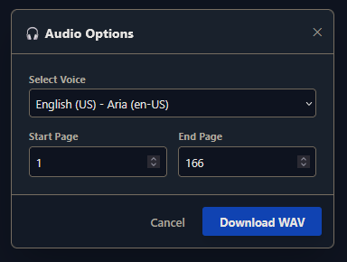

# WebReader - Scientific Speed Reader

A modern web application for speed reading PDFs, EPUBs, and Images using RSVP (Rapid Serial Visual Presentation) technology.



## Features

- **RSVP Speed Reading**: Read faster by eliminating eye movement.
- **Smart Automatic PDF Import**: Detects multi-column layouts (correct reading order), strips repeated headers/footers and standalone page numbers, and repairs words hyphenated across line breaks.
- **Format Support**: PDF, EPUB, TXT, DOCX, PPTX, and **Images** (.png, .jpg, .webp).
- **Accessibility analysis**: DOCX, PPTX and PDF files are checked for missing alt text, titles and language, heading and table structure, slide titles and reading order, and untagged PDFs. The result lists what is still open; it is not a compliance claim.
- **OCR Integration**: Automatically extracts text from scanned PDFs and images using Tesseract.
- **AI Image Captioning** *(Docker/Kubernetes only, optional)*: Photos and figures with no embedded text get an AI-generated description (via Florence-2) woven into the text WebReader reads and speaks, instead of being skipped entirely. Not included in the desktop build — see [Installation](#installation).
- **Text-to-Speech (TTS)**: Generate and download an MP3/WAV audio version of your document.
- **Manual Layout Editor**: Select specific text boxes to read on PDF files, skipping headers/footers.
- **Modern UI**: Clean, glassmorphism-based design with Dark Mode support.
- **Image Gallery**: View and download images extracted from your documents.

## Installation

There are three ways to run WebReader, depending on what you need. All three read/write the same document formats; they differ in setup effort and whether AI image captioning is included.

| | Desktop / Local | Docker Compose | Kubernetes |
|---|---|---|---|
| Setup effort | One script | One command | Helm chart |
| AI Image Captioning | Not included | Included | Included |
| Best for | Trying it out, personal use | A machine you leave running (homelab, NAS) | A cluster / always-on deployment |

### Option 1: Desktop / Local (Lightweight)

No AI image captioning (see the Features table above) — everything else works the same. This is the path the Windows desktop `.exe` release also uses.

**Prerequisites**: Python 3.9+, Node.js, Redis, and Tesseract OCR.

```bash
git clone https://github.com/Utility-SOC/WebReader.git
cd WebReader
```

**For Windows:**
```powershell
# Open PowerShell and run:
.\run_windows.ps1

# Or simply double-click run_windows.bat
```

**For Linux / macOS:**
```bash
# Make the script executable and run:
chmod +x run_linux.sh
./run_linux.sh
```

*Note: Ensure Redis is running in the background before launching the application.*

**No repo checkout needed**: every [release](https://github.com/Utility-SOC/WebReader/releases) includes `run_windows.ps1`/`.bat`/`run_linux.sh` already (in `WebReader-Portable.zip`), or grab the prebuilt `WebReader-Desktop-Windows.zip` (Windows only) for a double-click `.exe` with no Python/Node install at all.

### Option 2: Docker Compose (adds AI Image Captioning)

Runs the full stack in containers — FastAPI backend, Celery worker, Redis, and the frontend dev server — and is the only path that includes AI image captioning. That feature needs ~500MB+ of ML dependencies (PyTorch/transformers) that Option 1 deliberately skips to stay lightweight.

**Prerequisites**: Docker and Docker Compose.

```bash
git clone https://github.com/Utility-SOC/WebReader.git
cd WebReader

# Size the backend/worker memory cap to this machine's RAM (writes .env).
# Re-run this if you move to different hardware.
./scripts/detect-ml-mem-limit.sh

docker compose up -d
```

Open http://localhost:5173 (the backend API is on :8000 — `/health` for a quick check).

Captioning runs on CPU only (no GPU support) and has been tuned for
low-memory hosts; see the module docstring in `backend/captioning.py` for
the specifics if you're curious or troubleshooting a captioning-related
crash. If a container gets killed under memory pressure, raise the limit
`scripts/detect-ml-mem-limit.sh` wrote to `.env` (`ML_MEM_LIMIT`).

**No repo checkout needed**: every [release](https://github.com/Utility-SOC/WebReader/releases) includes a `WebReader-Docker-Deploy.zip` with a standalone `docker-compose.yml` (pulls prebuilt images from GHCR) and a `deploy.sh` that detects your RAM and starts everything:
```bash
unzip WebReader-Docker-Deploy.zip -d webreader-docker && cd webreader-docker
./deploy.sh
```

### Option 3: Kubernetes (Helm chart)

For a persistent, always-on deployment. See `charts/webreader/` — its
`values.yaml` and the `NOTES.txt` shown after install document the setup in
detail, including why backend and worker must stay at exactly 1 replica
(the app uses SQLite) and how memory limits are sized.

```bash
helm install webreader charts/webreader
```

Images are built and published to GHCR automatically on every push to
`main` (`.github/workflows/build-images.yml`); the chart's defaults already
point at them.

**No repo checkout needed**: every [release](https://github.com/Utility-SOC/WebReader/releases) includes a `WebReader-Kubernetes-Deploy.zip` with the packaged chart and a `deploy.sh` wrapper:
```bash
unzip WebReader-Kubernetes-Deploy.zip -d webreader-k8s && cd webreader-k8s
./deploy.sh [release-name] [namespace]   # both optional, default to "webreader"
```

## Document library (repository sync, search, reading room)

WebReader can index a repository of documents (PDF, DOCX, PPTX, TXT), check each for accessibility problems, and let people search and read them. It is configured with an admin CLI, deliberately not an HTTP API, so there is nothing for an anonymous visitor to reach.

```bash
# Add a source. Nothing is published unless you say what to include (deny by default).
python -m backend.library_cli add-source county --root /data/docs \
    --include 'public/**' --exclude 'public/drafts/**' \
    --rule 'public/planning/=Planning Commission:zoning,minutes'

python -m backend.library_cli sync county --dry-run   # see what would be added; changes nothing
python -m backend.library_cli sync county             # process new/changed files, detect removals
python -m backend.library_cli held county             # processed, but not yet visible to readers
python -m backend.library_cli release county          # publish (or: --path P for specific files)
python -m backend.library_cli withdraw county --path public/notes.txt
```

- **Hold queue:** new items are processed but stay hidden until released (use `--no-hold` to publish immediately).
- **Metadata provenance:** every title, author, agency and tag records where it came from (`original`, `rule`, `machine`, `human`) and is never overwritten; a revision adds a row and supersedes the old one.
- **Public API** (what a reading-room visitor can reach, with `WEBREADER_MODE=reading_room`): `GET /library/search`, `/library/facets`, `/library/items/{id}`, `/library/items/{id}/text`. It returns only released items and never exposes repository paths. Search terms are not logged or stored.
- Repositories are read through connectors (a plain folder today); S3, SFTP and SharePoint plug into the same interface.

### Accessibility report (admin)

```bash
python -m backend.library_cli report demo --html report.html --csv issues.csv
```

Prints a summary and writes a **single, self-contained HTML page** (no scripts, no external requests, strict content-security policy; light/dark; keyboard- and screen-reader-friendly) and a CSV with one row per issue. It shows what to fix first (with plain-language "why it matters" and "how to fix it" for each problem), every document with its issues, files that could not be processed, and titles that software inferred and a person should review. Issues are marked by how they can be fixed: automatically, with a software suggestion a person confirms, or by a person.

It lists repository paths and titles, so it is **admin-only by design (a file, not a web page)**: keep it internal. It reports what the automatic checks found and is not a compliance claim. Check the page itself with `./scripts/report-check.sh report.html`.

### Try it with sample documents

```bash
docker compose up -d
./scripts/demo-seed.sh        # builds ./demo-repo (incl. a scanned PDF and files with typical accessibility problems) and loads it
```

Then open http://localhost:5173/#/library. Run `./scripts/ui-check.sh` for a browser check of the library UI (axe in light and dark, keyboard-only search, paging and focus, labelling of software-inferred titles, privacy, 320px reflow).

## AI providers (image captioning)

Captioning describes photos and figures so they are read aloud and shown as image alt text. Choose where it runs:

| Provider | `WEBREADER_CAPTION_PROVIDER` | Private? | Notes |
|---|---|---|---|
| Local model | `local` (default) | Yes — nothing leaves your machine | Florence-2 on CPU, ~2.5GB RAM; Docker/Kubernetes only |
| OpenAI-compatible APIs | `openai`, `deepseek`, `kimi`, `custom` | No — images are sent to the provider | `custom` takes any compatible endpoint via `WEBREADER_LLM_BASE_URL` (including a self-hosted one) |
| Native APIs | `gemini`, `anthropic` | No | |
| Off | `none` | Yes | |

For anything but `local` and `none` you also set `WEBREADER_LLM_MODEL` (it must accept images; DeepSeek's text-only models won't) and `WEBREADER_LLM_API_KEY`. These are API keys you paste in, not account logins. API providers need no ML libraries, so they also work in the lightweight desktop install (Option 1).

- **Desktop / Docker Compose:** run `./scripts/setup-ai.sh` (it prompts, hides the key, and writes `.env` readable only by you), then restart. On Windows, create `.env` with the variables above; `run_windows.ps1` loads it. The Docker release zip includes `setup-ai.sh` too.
- **Kubernetes:** set the `ai:` block in `charts/webreader/values.yaml`. Prefer `ai.existingSecret` (a Secret you create with a `WEBREADER_LLM_API_KEY` key) over `ai.apiKey`, so the key stays out of Helm release history.
- `GET /ai/status` shows the active provider (never the key).

## Configuration

Environment variables the backend/worker read (already set correctly by
`docker-compose.yml` and the Helm chart; only relevant if you're running
things manually or debugging):

| Variable | Default | Purpose |
|---|---|---|
| `CELERY_BROKER_URL` | `redis://localhost:6379/0` | Redis connection for the Celery task queue |
| `TESSERACT_CMD` | auto-detected | Path to the `tesseract` binary, if it's not on `PATH` |
| `WEBREADER_EMBEDDED` | unset | Set to `1` to run Celery tasks in-process with no Redis/worker needed (used by the desktop build) |
| `WEBREADER_DATA_DIR` | next to the source | Where the desktop app stores its SQLite database and settings |
| `WEBREADER_CAPTION_PROVIDER`, `WEBREADER_LLM_MODEL`, `WEBREADER_LLM_API_KEY`, `WEBREADER_LLM_BASE_URL` | `local` | See [AI providers](#ai-providers-image-captioning) |
| `WEBREADER_OCR_DPI`, `WEBREADER_OCR_LANG` | `200`, `eng` | Resolution and language for the OCR fallback (tesseract) used when a PDF has no usable text layer |
| `WEBREADER_OCR_VERIFY` | `auto` | `auto` / `always` / `never`: whether a suspicious or scanned PDF's text layer is checked against OCR of a few sampled pages |
| `WEBREADER_UPLOAD_ANALYSIS` | unset | Set to `1` to run the (slower) accessibility analysis on PDFs you upload to read; the library always runs it |
| `ML_MEM_LIMIT` | `4g` | Docker Compose only — memory cap for the backend/worker containers; auto-written to `.env` by `scripts/detect-ml-mem-limit.sh` |

## Basic Tutorial

WebReader is designed to be intuitive and fast. Here is how to use the core features:

### 1. Uploading a Document
- Click the **upload area** on the main screen to select a supported document (PDF, EPUB, TXT, DOCX, or Image).

**PDF Manual Extraction**: 
When you upload a PDF, you will be prompted to choose between Automatic Import or the Manual Editor:



**Automatic Import** now handles most documents well on its own: it detects multi-column layouts and reads them in the correct order, and automatically removes repeated headers, footers, and page numbers.

If you select **OK**, you will enter the Manual Layout Editor. This powerful tool allows you to visually select exactly what text to read, ensuring you skip headers, footers, page numbers, or irrelevant sidebars — useful for unusual layouts the automatic mode can't handle.

*(Note: WebReader automatically saves your manual layout mappings! By default, if the application is hosted for multiple users, anyone accessing that same PDF later can instantly benefit from the layout boxes you have already configured.)*


**How to use the Manual Editor**:
1. **Draw Boxes**: Simply click and drag your mouse over the text blocks you want to read. A blue box will appear around your selection.
2. **Fit & Resize**: You can adjust the edges of your drawn boxes by clicking and dragging the black squares in the corners. If the page is too large or too small, toggle the **FIT / 1:1** button in the top toolbar to adjust the zoom level.

3. **Auto-Copy Layouts**: When you navigate to the next page using the top navigation arrows, you will notice that you do not have to redraw your rectangles! WebReader automatically copies your layout boxes from the previous page, allowing you to quickly verify or tweak the boxes rather than starting from scratch.


4. **Extract Images**: Want to save a picture from the PDF? Click the **Image button** (the picture icon) in the upper central toolbar. This allows you to draw an orange box to pull out pictures in the exact same way you pull out text!

5. **Mixed Content**: You can freely mix text and image extractions on a single page to capture everything important without reading the figures as text.

6. **Set Starting Page**: If the actual content of your book starts on a later page (e.g., page 15 after the table of contents and prefaces), navigate to that page using the arrows in the top left, and click **"Start Here"**. This marks the current page as the starting point for your reading session.

7. **Finish**: Once you have highlighted the layout blocks on the starting page, click **DONE** in the top right. WebReader will begin processing!

**EPUB Chapter Selection**: 
When uploading an EPUB, the application automatically extracts the table of contents. Once processing is complete, you can click the **Book icon** to open the Chapter Selector and immediately jump to the start of any chapter.

### 2. Reading with RSVP
- **Play/Pause**: Once processing is complete, press the large **Play** button (or click anywhere in the reading area) to start Rapid Serial Visual Presentation.
- **Navigation**: Use the **Left/Right arrows** to skip backward or forward by 50 words.
- **Progress Bar**: Drag the scrubber at the bottom to jump to any point in the text.

### 3. Customizing the Experience
The primary interface provides several ways to tailor WebReader to your cognitive preferences.



- **Reading Presets**: We offer curated presets like Standard RSVP, ORP Alignment, Cognitive Chunking, and Typographic Guidance based on cognitive science research to get you started quickly.
- **Font Selection**: Click the **Gear icon** in the top right to open **Settings**, where you can select fonts tailored for reading efficiency, including Atkinson Hyperlegible (for low vision) and OpenDyslexic.

- **Speed & Chunk Size**: Adjust your target Words Per Minute (WPM). You can also increase the **Chunk Size** (e.g., up to 6) to read a larger section of text at once, which is helpful for "Cognitive Chunking" of phrases.

- **Advanced Mechanics**: Click the Gear icon to access advanced visual features:
  - **ORP Pivot**: The Optimal Recognition Point (ORP) is the colored letter in the center of the display. Highlighting this pivot point minimizes the distance your eyes need to dart left and right. You can manually adjust this pivot position.
  - **Bionic Bolding**: Enabling this feature bolds the first few letters of every word, artificially guiding your eyes to the most critical parts of the word for faster comprehension.

- **Dynamic Punctuation**: Adjust delay multipliers for commas, periods, and paragraphs so the reading pace feels natural.

### 4. Advanced Features
- **Chapters (Book Icon)**: When reading an EPUB, click the book icon to navigate directly to specific chapters.
- **Gallery (Image Icon)**: If your document contains illustrations or figures, click the image icon to view them in a dedicated gallery.
- **Audio Export (TTS)**: 
  - Click the **Headphones icon** in the top right control bar to generate a high-quality audiobook version of your document.
  
  - In the Audio Options modal, you can select the AI Voice you want to use and specify the exact page range (e.g., from Chapter 1 to Chapter 3). Click **Download WAV** to generate and save the audio file.
  
- **Text Transcript**: Click the **Document icon** to download a clean text transcript (`.txt`) of your file.

## Troubleshooting

- **Upload Stuck?**: Ensure the worker process started correctly from the launch script. The API delegates heavy processing to Celery.
- **OCR Failed?**: Ensure `tesseract` is installed and in your system PATH.
- **No AI image captions?**: Expected on the desktop build / `run_linux.sh` / `run_windows` (see Installation) — images still get OCR'd normally either way. On Docker/Kubernetes, check the backend/worker logs for `Image captioning disabled: ...`, which means the ML dependencies didn't install correctly.
- **Backend or worker container OOMKilled (Docker)?**: Raise `ML_MEM_LIMIT` in `.env` (regenerate it with `./scripts/detect-ml-mem-limit.sh`, or edit it directly) and restart with `docker compose up -d`.
- **Docker build failing after pulling changes?**: Rebuild explicitly with `docker compose up -d --build` — Compose doesn't always detect that `backend/Dockerfile` or `requirements.txt` changed.

## License

WebReader is MIT licensed (see `LICENSE`).

Third-party components and their licenses are listed in
[`THIRD_PARTY_LICENSES/THIRD_PARTY_NOTICES.md`](THIRD_PARTY_LICENSES/THIRD_PARTY_NOTICES.md)
(generated from the real package metadata by `scripts/generate-notices.sh`).
Full license texts ship in the `THIRD_PARTY_LICENSES` folder of every desktop
release and inside the Docker image at `/app/THIRD_PARTY_LICENSES/`. This
includes [Tesseract OCR](https://github.com/tesseract-ocr/tesseract)
(Apache License 2.0) and its Leptonica dependency, the bundled fonts (SIL Open
Font License 1.1), and the optional image-captioning model.

See `AI_DISCLOSURE.md` for a note on AI in this project.
